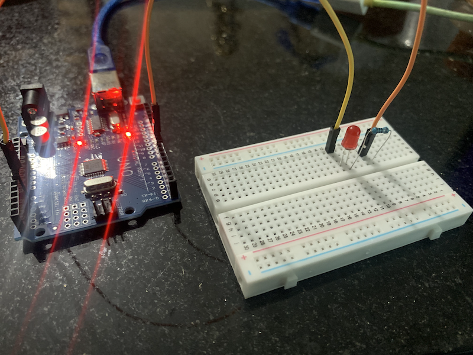

# Projeto 01 – LED Flasher com Arduino  
### Projeto básico para piscar um LED utilizando o Arduino UNO

**ENGLISH**  
This is a basic Arduino project to flash a single LED. It's often the first step to understand how digital outputs work on microcontrollers.

**Components**  
- Arduino UNO  
- 1 LED (red)  
- 1 Resistor (150Ω)  
- Breadboard and jumper wires  

**How it works**  
The code uses the `digitalWrite()` function to turn the LED on and off in a loop, creating a flashing effect. It’s a foundational project to test your board and understand pin logic.

**PORTUGUÊS**  
Este é um projeto básico de Arduino para piscar um único LED. Costuma ser o primeiro passo para entender como funcionam as saídas digitais nos microcontroladores.

**Componentes**  
- Arduino UNO  
- 1 LED (vermelho)  
- 1 Resistor (150Ω)  
- Protoboard e jumpers  

**Como funciona**  
O código utiliza a função `digitalWrite()` para ligar e desligar o LED em um loop, criando o efeito de piscar. É um projeto fundamental para testar sua placa e entender a lógica dos pinos digitais.

---

### Preview
- 

  

### Source Code | Código-fonte  
- [projeto01_led_flasher.ino](projeto01_led_flasher.ino)

### Demonstration | Demonstração  
- [Watch on YouTube](https://youtu.be/0FgIq34k_Ug)
