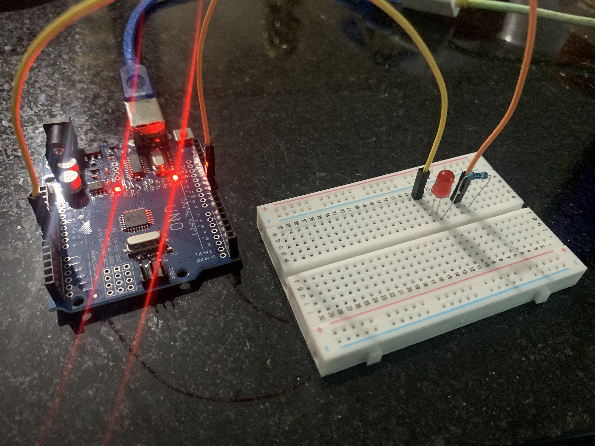

# Projeto 02 – Sinal de SOS em LED  
### Simulação do código Morse para SOS com LED e Arduino

**ENGLISH**  
This project simulates an SOS signal in Morse code using a single LED connected to an Arduino. It reinforces control over digital outputs and introduces timing logic based on Morse dot and dash patterns.

**Components**  
- Arduino UNO  
- 1 LED (red)  
- 1 Resistor (150Ω)  
- Breadboard and jumper wires  

**How it works**  
The LED blinks a pattern representing "SOS" (three short, three long, three short) in Morse code. Timings are controlled via the `delay()` function to reproduce the signal accurately.

**PORTUGUÊS**  
Este projeto simula um sinal de SOS em código Morse usando um único LED conectado ao Arduino. Ele reforça o controle sobre saídas digitais e introduz a lógica de temporização com base nos padrões de ponto e traço do código Morse.

**Componentes**  
- Arduino UNO  
- 1 LED (vermelho)  
- 1 Resistor (150Ω)  
- Protoboard e jumpers  

**Como funciona**  
O LED pisca em um padrão que representa "SOS" (três curtos, três longos, três curtos) em código Morse. Os tempos de `delay()` são ajustados para simular pontos e traços corretamente.

---

### Preview  

### Código-fonte  
Veja o arquivo [projeto02_sos_led.ino](projeto02_sos_led.ino)

### Demonstração (vídeo)  
[https://youtu.be/EhnPLhQSbWk](https://youtu.be/EhnPLhQSbWk)
